Based on your home lab setup from memory:

| Device | Specs | IP |
|--------|-------|-----|
| **Main** | Win11/WSL, i9-10850K, 64GB, RTX4090 | .48 |
| **NAS** | DS220+, 8TB, 10GB RAM | .14 |
| **Mac** | M1, 1TB+2TB | .24 |
| **Linux** | MS-A2, Ubuntu 24.04, 1TB | .34 |

## Recommended Service Distribution

### NAS (.14) - Gateway & Storage Layer
**Primary entry point via Cloudflare Tunnel**
| Service | Reason |
|---------|--------|
| **cloudflared** | Cloudflare Tunnel endpoint (receives traffic from Cloudflare Edge) |
| **Traefik :80/:443** | Main ingress controller, routes to local services and Tailscale nodes |
| **MinIO** | Object storage on dedicated NAS with 8TB (local routing) |
| **GitLab CE** | Git repos need persistent, reliable storage (local routing) |

> ⚠️ DS220+ has limited CPU (Celeron J4025). GitLab may be slow - consider running GitLab on Linux (.34) with NAS as volume mount instead.

### Linux (.34) - k3s Cluster
**Kubernetes workloads via Tailscale**
| Service | Reason |
|---------|--------|
| **k3s** | Lightweight Kubernetes distribution, always-on server |
| **Traefik Ingress** | Ingress controller inside k3s cluster |
| **k3s Pods** | Containerized workloads (Pod A, Pod B, etc.) |

### Main (.48) - GPU Workloads
**WSL2 + RTX 4090 for compute-intensive tasks**
| Service | Reason |
|---------|--------|
| **WSL2** | Linux environment on Windows |
| **RTX 4090 Workloads** | Heavy AI/ML tasks using GPU acceleration |
| *(Not 24/7 services)* | Windows/WSL less stable for infra, GPU workloads on-demand |

### Mac (.24) - Docker Services
**Docker-based services via Tailscale**
| Service | Reason |
|---------|--------|
| **Traefik** | Ingress controller for Docker services |
| **Docker Services** | Containerized services (Service A, Service B, etc.) using Traefik labels |

---

## Recommended Architecture

```
                    ┌─────────────────────────────────────┐
                    │            Internet                 │
                    │              User                   │
                    └─────────────────────────────────────┘
                              │ HTTPS
                              ▼
                    ┌─────────────────────────────────────┐
                    │        Cloudflare Edge               │
                    └─────────────────────────────────────┘
                              │ Tunnel
                              ▼
                    ┌─────────────────────────────────────┐
                    │         Tailscale VPN Mesh          │
                    │         (Private Network)           │
                    └─────────────────────────────────────┘
                                      │
        ┌─────────────────────────────┼─────────────────────────────┐
        │                             │                             │
        ▼                             ▼                             ▼
┌───────────────┐           ┌───────────────┐           ┌───────────────┐
│ linux-01 (.34)│           │  NAS (.14)    │           │ win-4090 (.48)│
│   Ubuntu 24   │           │   DS220+      │           │  Win11/WSL    │
│   (k3s)       │           │  (Gateway)    │           │   (GPU)       │
├───────────────┤           ├───────────────┤           ├───────────────┤
│ • Traefik     │◄─Tailscale│ • cloudflared │           │ • WSL2        │
│   Ingress     │   (dotted)│ • Traefik     │           │ • RTX 4090    │
│ • k3s Pods    │           │   :80/:443    │           │   Workloads   │
│   - Pod A     │           │ • MinIO       │           └───────────────┘
│   - Pod B     │           │   (Local)     │
└───────────────┘           │ • GitLab CE   │
                            │   (Local)     │
                            └───────────────┘
                                      │
                                      │ Tailscale (dotted)
                                      ▼
                            ┌───────────────┐
                            │  mac-m1 (.24) │
                            │     M1        │
                            ├───────────────┤
                            │ • Traefik     │
                            │ • Docker      │
                            │   Services    │
                            │   - Service A │
                            │   - Service B │
                            └───────────────┘
```

**Traffic Flow:**
1. External users → Cloudflare Edge (HTTPS)
2. Cloudflare Edge → Tunnel → cloudflared on NAS
3. cloudflared → Traefik :80/:443 on NAS
4. Traefik routes:
   - **Local**: MinIO, GitLab CE (on NAS)
   - **Tailscale**: linux-01 (k3s), win-4090 (GPU), mac-m1 (Docker)

### Mermaid Architecture Diagram

```mermaid
flowchart TB
    subgraph Internet["🌐 Internet"]
        User[👤 User]
        CF[☁️ Cloudflare Edge]
    end

    subgraph Tailscale["🔒 Tailscale VPN Mesh"]
        subgraph NAS["🗄️ NAS (Gateway, 24h)"]
            CFD[cloudflared]
            TraefikNAS[Traefik :80/:443]
            GitLab[GitLab CE]
            MinIO[MinIO]
        end

        subgraph MacMini["🍎 mac-m1"]
            TraefikMac[Traefik]
            subgraph DockerMac["Docker Services"]
                DockerSvc1[Service A]
                DockerSvc2[Service B]
            end
        end

        subgraph Linux01["🐧 linux-01 (k3s)"]
            TraefikK3S[Traefik Ingress]
            subgraph K3SPods["k3s Pods"]
                K3SSvc1[Pod A]
                K3SSvc2[Pod B]
            end
        end

        subgraph Win4090["🎮 win-4090 (GPU)"]
            WSL[WSL2]
            GPU[RTX 4090 Workloads]
        end
    end

    %% External Traffic Flow
    User -->|HTTPS| CF
    CF -->|Tunnel| CFD
    CFD --> TraefikNAS

    %% NAS Traefik Routing (Local)
    TraefikNAS -->|Local| GitLab
    TraefikNAS -->|Local| MinIO

    %% NAS → Internal (via Tailscale)
    TraefikNAS -.->|Tailscale| TraefikMac
    TraefikNAS -.->|Tailscale| TraefikK3S
    TraefikNAS -.->|Tailscale| Win4090

    %% Mac Traefik Routing
    TraefikMac -->|Labels| DockerSvc1
    TraefikMac -->|Labels| DockerSvc2

    %% k3s Traefik Routing (최종)
    TraefikK3S -->|Ingress| K3SSvc1
    TraefikK3S -->|Ingress| K3SSvc2

    %% Styling
    style Tailscale fill:#4c51bf,stroke:#333,color:#fff
    style NAS fill:#f1c40f,stroke:#333
    style MacMini fill:#95a5a6,stroke:#333
    style Linux01 fill:#27ae60,stroke:#333
    style Win4090 fill:#e74c3c,stroke:#333
    style Internet fill:#ecf0f1,stroke:#333
```



## Quick Start Priority

1. **NAS (.14) - Gateway Setup**:
   - Install cloudflared and configure Cloudflare Tunnel
   - Install Traefik and configure routing rules
   - Setup MinIO for object storage
   - Setup GitLab CE (or decide: NAS vs Linux)

2. **Linux (.34) - k3s Cluster**:
   - Install k3s
   - Configure Traefik Ingress controller
   - Deploy initial pods/services

3. **Mac (.24) - Docker Services**:
   - Install Traefik with Docker
   - Configure Traefik labels for service discovery
   - Deploy Docker services

4. **Main (.48) - GPU Workloads**:
   - Setup WSL2 environment
   - Configure GPU access for workloads
   - Connect to Tailscale network

5. **Tailscale Configuration**:
   - Ensure all nodes are in Tailscale VPN mesh
   - Configure routing rules in NAS Traefik to reach other nodes
